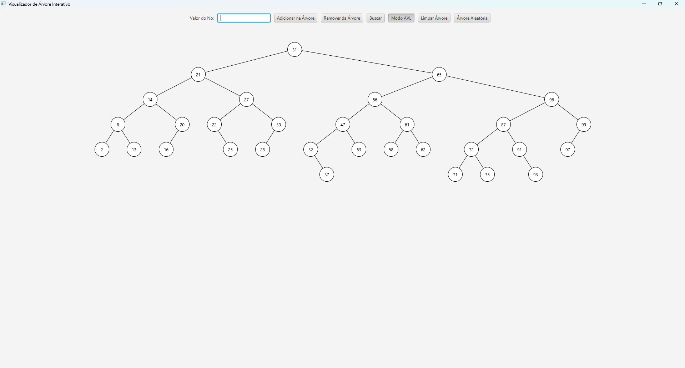

# VisualizadorAVL

📝 Descrição

Este projeto é uma ferramenta gráfica e interativa desenvolvida como projeto acadêmico para a disciplina de Linguagem de Programação 3.

A aplicação permite a manipulação completa das árvores, exibindo em tempo real as operações de inserção, remoção, busca. A interface gráfica foi desenvolvida utilizando a biblioteca JavaFX.

✨ Funcionalidades

Visualização Gráfica: Desenho da estrutura da árvore em tempo real.

Seleção de Estrutura: Permite ao usuário alternar entre uma Árvore Binária de Busca e uma Árvore AVL.

Operações CRUD:

Inserção: Adiciona novos nós à árvore.

Busca: Procura por um valor específico, destacando o caminho percorrido.

Remoção: Exclui nós existentes, reorganizando a árvore conforme as regras de cada estrutura.

🛠️ Tecnologias Utilizadas

Java 17

JavaFX: Para a construção de toda a interface gráfica do usuário (GUI).

Maven: Para gerenciamento de dependências do projeto, especialmente do JavaFX.

Status: Concluído ✔️

👨‍💻 Autor

Desenvolvido por Cauan Mendonça Valadão
